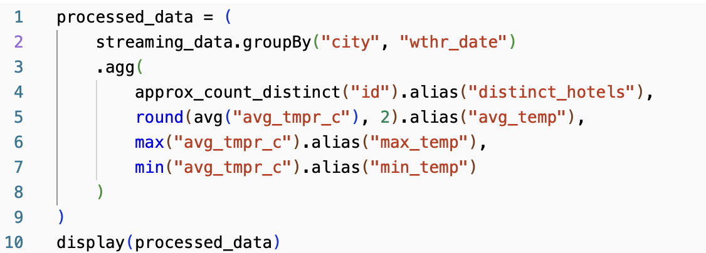
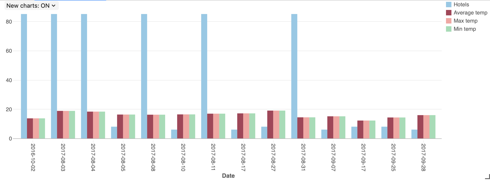

# Spark Streaming Homework

### Repository link https://github.com/MeriDm7/spark-streaming.git

## Setup infrastructure
- Download `m13sparkstreaming.zip` file.
- Navigate to the `dataStorage` folder inside the `terraform` directory. Add the path to the downloaded m13sparkstreaming data in  the`data_storage_upload.tf` file, and then run the Terraform scripts.

```bash
terraform init
terraform apply
```
- Navigate to the `terraform` directory and run Terraform scripts again.
- The Databricks Workspace and Storage Account are deployed.

## Organize incremental copy
- Run the `az_copy.sh` script to incrementally copy hotel/weather data from the initial storage account to the new storage account, with a 10-second delay between each file.


- To automate script execution, open crontab.
```bash
crontab -e
```
- Add a new line to schedule the script to run every day at 12 pm.

```bash
0 12 * * * /path/to/az_copy.sh
```

## Configure Databricks Workspace

- Log in to created Databricks Workspace. In `Compute` section start new Single Node cluster.
- Create a new Databricks notebook and connect it to the cluster.
- Use the Databricks CLI to connect to the Azure Databricks workspace. Create a new secret scope to store the secret keys for the Storage Account. 
```bash
databricks configure --token
databricks secrets create-scope --scope <scope-name>
databricks secrets put --scope <scope-name> --key <key-name> --string-value <your-secret>
```

## Databricks notebook 

- Connect to hotel/weather data Storage Account


- Create Spark Stream using Auto Loader


- Aggregate the streaming data. Group by `city` & `date` columns and calculate distinct hotels, average/min/max temperature.




- Write the processed streaming data into a Delta table


## Visualize data

### Top 10 biggest cities


- Paris


- London


- Barcelona


- Milan


- Amsterdam




- Paddington


- New York


- San Diego


- Memphis


- Vienna


